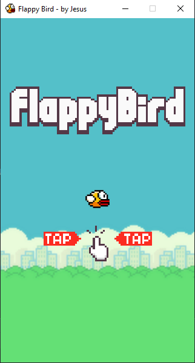

# Flappy-Bird

> My version of the classic Flappy Bird game.

---

## Description

This is the Flappy Bird game I developed in Python. The player jumps with the SPACE key or by clicking (Mouse).
The goal is to avoid the pipes that appear randomly. Each tube passed increases the score by one point.
If the bird collides with any pipe, or the upper / lower part of the screen, the game is over.

---

## Author Info

- Twitter - [@andre_j3sus](https://twitter.com/andre_j3sus)
- Website - [André Jesus](https://sites.google.com/view/andre-jesus/p%C3%A1gina-inicial)

[Back To The Top](#flappy-bird)